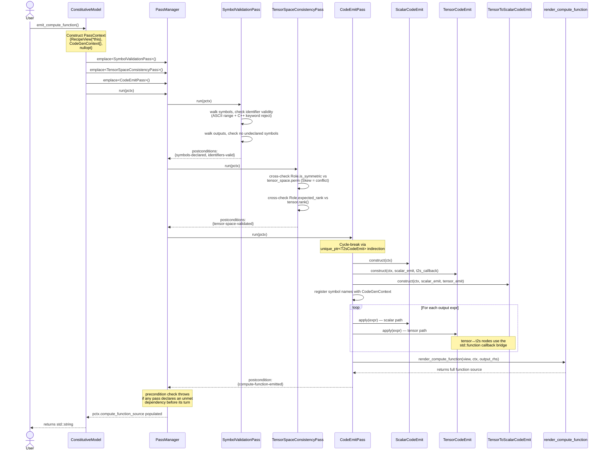
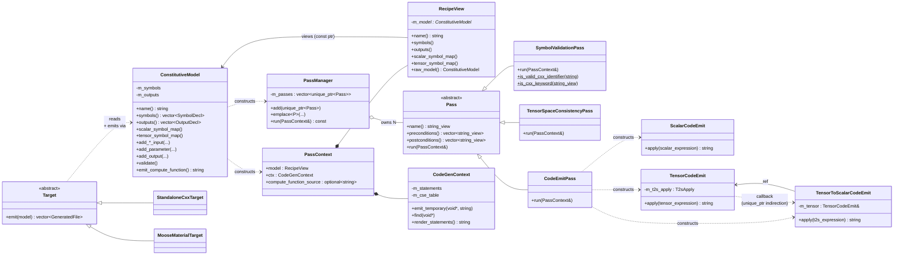

# numsim-codegen Workflow

Three views of the same system: the high-level user workflow (activity), the pass-pipeline runtime flow (sequence), and the static class structure. Reflects the codebase after PRs #51–#55 land (i.e. with the Phase-1.2 pass framework + the M2–M6 follow-ups).

---

## 1. High-level workflow (activity)

User-facing flow from recipe construction to generated source on disk.

```mermaid
flowchart TD
    A[User builds ConstitutiveModel] --> B[add_scalar_input<br/>add_tensor_input<br/>add_parameter]
    B --> C[add_output with semantic Role]
    C --> D[Pick a Target<br/>StandaloneCxx / MooseMaterial / ...]
    D --> E[Target.emit&#40;model&#41;]
    E --> F[Target calls<br/>model.emit_compute_function&#40;&#41;]
    F --> G[Pass pipeline runs<br/>see Sequence below]
    G --> H[Target wraps result<br/>with framework framing<br/>&#40;headers, class decl, ...&#41;]
    H --> I[User writes generated<br/>files to disk]

    style F fill:#e1f5e1
    style G fill:#fff4d6
```

The CAS expression DAG (numsim-cas) lives "behind" the recipe — `add_output(name, expr, role)` accepts an `expression_holder<scalar|tensor>` built via cas operators. The DAG is immutable through this entire flow; passes consume it and emit code referencing its leaves.

---

## 2. Pass pipeline (sequence)

What happens when `model.emit_compute_function()` is called. This is the core of the system.

**Key invariants:**
- Each pass advertises **preconditions** (tags it needs satisfied first) and **postconditions** (tags it satisfies on success). `PassManager::run` enforces these in registration order — registering a pass with unmet preconditions throws *before* the pass runs.
- The **`CodeEmitPass` cycle-break** uses `std::unique_ptr<TensorToScalarCodeEmit>` indirection because `TensorCodeEmit` requires a `T2sApply` callback at construction (M3) but `TensorToScalarCodeEmit` holds a `TensorCodeEmit&` — a real cycle. The lambda captures the storage pointer; it's only invoked AFTER `make_unique` populates it.
- The **CodeGenContext** accumulates `auto tN = ...;` lines via pointer-keyed CSE. Two references to the same `expression_holder` DAG node emit one temp, not two.

---

## 3. Static structure (class)

The abstractions and their relationships. Trimmed to the spine — accessors and field details omitted.

---

## 4. What's outside the framework

Three layers wrap or feed the pipeline above:

- **numsim-cas** (external dependency, pinned via CPM): the symbolic expression DAG. Tensor / scalar / tensor-to-scalar expression types, the `expression_holder<T>` shared_ptr handle, the simplifier, the substitute/diff machinery. The recipe holds *handles*; the DAG itself is immutable through codegen.
- **tmech** (system include): the generated source's tensor type. Expression-template-backed; provides `tmech::adaptor<...>` for zero-copy bridging at the FEM-framework boundary (MOOSE `RealTensorValue`, deal.II `Tensor<rank, dim>`).
- **Backends** (`include/numsim_codegen/targets/`): wrap `emit_compute_function()` output with framework-specific framing. `StandaloneCxxTarget` outputs a single inline header. `MooseMaterialTarget` outputs a `.h` + `.C` pair implementing a MOOSE `Material` subclass. Future targets (`AbaqusUMATTarget`, `AnsysUSERMATTarget`) follow the same pattern.

---

## 5. Phase 2 / 3 extension points

Where future work plugs in (per epic #28 and follow-up issue #56):

| Phase | Addition | Insertion point |
|---|---|---|
| **2** | `TimeIntegrationPass` lowering `Dt(α) → (α_new − α_old)/dt` via cas substitute | Between SymbolValidationPass and CodeEmitPass; advertises `dt-lowered` postcondition |
| **2** | `KuhnTuckerLoweringPass` rewriting NCP constraints to Fischer-Burmeister | Between SymbolValidationPass and CodeEmitPass; advertises `kt-lowered` |
| **2** | `LocalNewtonLoweringPass` emitting the Newton iteration body | Between lowering passes and CodeEmitPass |
| **2** | Mutable `RecipeView` surface for the above rewrites | See #56 / P1 — sibling typed view or `variant` storage |
| **3** | `AlgorithmicTangentPass` (consistent tangent via implicit diff) | After Newton lowering, before CodeEmitPass |
| **3** | `TangentEmitPass` / `MoosePropertyEmitPass` (additional emit targets) | After CodeEmitPass or replacing it depending on target |
| **3** | `CodeEmitPipeline` aggregate replacing the unique_ptr cycle break | See #56 / P2 |

The pass framework's value proposition is exactly this: new behaviour ships as a new `Pass` subclass + a one-line `pm.emplace<...>()` registration in the pipeline. The existing passes don't need to change.
