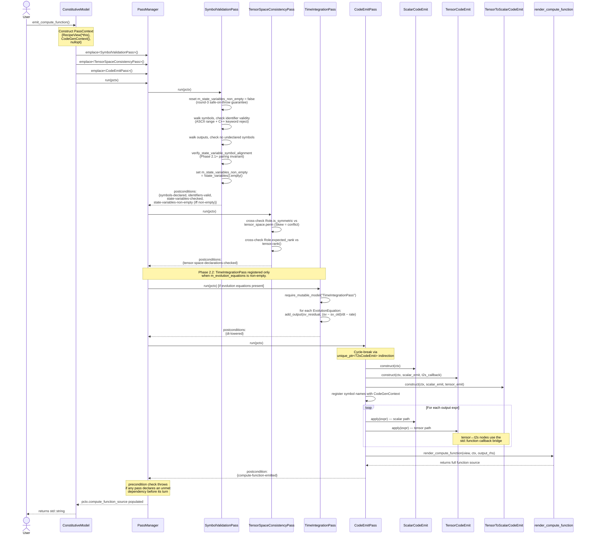

# numsim-codegen Workflow

Three views of the same system: the high-level user workflow (activity), the pass-pipeline runtime flow (sequence), and the static class structure. Reflects the codebase after PRs #51–#55 land (i.e. with the Phase-1.2 pass framework + the M2–M6 follow-ups).

---

## 1. High-level workflow (activity)

User-facing flow from recipe construction to generated source on disk.

```mermaid
flowchart TD
    A[User builds ConstitutiveModel] --> B[add_scalar_input<br/>add_tensor_input<br/>add_parameter]
    B --> SV[add_scalar_state_variable<br/>add_tensor_state_variable<br/>&#40;Phase 2.1&#41;]
    SV --> C[add_output with semantic Role]
    C --> D[Pick a Target<br/>StandaloneCxx / MooseMaterial / ...]
    D --> E[Target.emit&#40;model&#41;]
    E --> F[Target calls<br/>model.emit_compute_function&#40;&#41;]
    F --> G[Pass pipeline runs<br/>see Sequence below]
    G --> H[Target wraps result<br/>with framework framing<br/>&#40;headers, class decl, ...&#41;]
    H --> I[User writes generated<br/>files to disk]

    style F fill:#e1f5e1
    style G fill:#fff4d6
    style SV fill:#e1f0ff
```

**Phase 2.1 addition (blue node):** state variables declare a pair of
symbols per entry — `<name>` for the value the recipe writes (Newton
iterates on this) and `<name>_old` for the framework-supplied
previous-step value. Both live in `m_symbols` with categories
`StateVariableCurrent` / `StateVariableOld`, and flow through the same
validation + emit pipeline as inputs and parameters. The returned
`Handle{current, previous}` lets the user write evolution equations
like `Dt(α.current − α.previous) = ...` that Phase 2.2's
`TimeIntegrationPass` lowers into discrete update forms.

The CAS expression DAG (numsim-cas) lives "behind" the recipe — `add_output(name, expr, role)` accepts an `expression_holder<scalar|tensor>` built via cas operators. The DAG is immutable through this entire flow; passes consume it and emit code referencing its leaves.

---

## 2. Pass pipeline (sequence)

What happens when `model.emit_compute_function()` is called. This is the core of the system.

**Key invariants:**
- Each pass advertises **preconditions** (tags it needs satisfied first) and **postconditions** (tags it satisfies on success). `PassManager::run` enforces these in registration order — registering a pass with unmet preconditions throws *before* the pass runs.
- The **`CodeEmitPass` cycle-break** uses `std::unique_ptr<TensorToScalarCodeEmit>` indirection because `TensorCodeEmit` requires a `T2sApply` callback at construction (M3) but `TensorToScalarCodeEmit` holds a `TensorCodeEmit&` — a real cycle. The lambda captures the storage pointer; it's only invoked AFTER `make_unique` populates it.
- The **CodeGenContext** accumulates `auto tN = ...;` lines via pointer-keyed CSE. Two references to the same `expression_holder` DAG node emit one temp, not two.

---

## 3. Static structure (class)

The abstractions and their relationships. Trimmed to the spine — accessors and field details omitted.

---

## 4. What's outside the framework

Three layers wrap or feed the pipeline above:

- **numsim-cas** (external dependency, pinned via CPM): the symbolic expression DAG. Tensor / scalar / tensor-to-scalar expression types, the `expression_holder<T>` shared_ptr handle, the simplifier, the substitute/diff machinery. The recipe holds *handles*; the DAG itself is immutable through codegen.
- **tmech** (system include): the generated source's tensor type. Expression-template-backed; provides `tmech::adaptor<...>` for zero-copy bridging at the FEM-framework boundary (MOOSE `RealTensorValue`, deal.II `Tensor<rank, dim>`).
- **Backends** (`include/numsim_codegen/targets/`): wrap `emit_compute_function()` output with framework-specific framing. `StandaloneCxxTarget` outputs a single inline header. `MooseMaterialTarget` outputs a `.h` + `.C` pair implementing a MOOSE `Material` subclass. Future targets (`AbaqusUMATTarget`, `AnsysUSERMATTarget`) follow the same pattern.

---

## 5. Phase 2 / 3 extension points

Where future work plugs in (per epic #28 and follow-up issue #56):

| Phase | Addition | Insertion point | Status |
|---|---|---|---|
| **2.1** | `StateVariable` IR + `add_*_state_variable` API + RecipeView delegate | `ConstitutiveModel`, `RecipeView`, `SymbolDecl::Category` | ✓ landed |
| **2.2** | `EvolutionEquation` IR + `TimeIntegrationPass` lowering `Dt(α) → (α − α_old)/dt` via mutate-recipe (synthesises `<sv>_residual` outputs) | Between SymbolValidationPass and CodeEmitPass; advertises `dt-lowered` postcondition. Scalar-only; tensor evolutions deferred. | ✓ landed |
| **2.3** | `Equation` + `ComplementarityConstraint` IR types | `ConstitutiveModel` IR section | next |
| **2.4** | `LocalNewtonSystem` IR (unknown state vars + residual expressions) | New section on `ConstitutiveModel` | next |
| **2.5** | `KuhnTuckerLoweringPass` rewriting NCP constraints to Fischer-Burmeister | Between SymbolValidationPass and CodeEmitPass; advertises `kt-lowered` | next |
| **2.6** | `LocalNewtonLoweringPass` emitting the Newton iteration body | Between lowering passes and CodeEmitPass | next |
| **2.6** | MOOSE backend wiring (`getMaterialPropertyOld<>` / `declareProperty<>`) | `MooseMaterialTarget`; switches on `Category::StateVariable*` | next |
| **2.7** | Standalone backend: state-variable buffer args | `StandaloneCxxTarget` | next |
| **3a** | `AlgorithmicTangentPass` (consistent tangent via implicit diff) | After Newton lowering, before CodeEmitPass | future |
| **3b** | `TangentEmitPass` / `MoosePropertyEmitPass` (additional emit targets) | After CodeEmitPass or replacing it depending on target | future |

The pass framework's value proposition is exactly this: new behaviour ships as a new `Pass` subclass + a one-line `pm.emplace<...>()` registration in the pipeline. The existing passes don't need to change.

---

## 6. Conventions

### 6.1 Fallible-API style: `std::expected` vs nullable pointer

The codebase uses two patterns for fallible lookups / operations:

| Failure shape | Idiom | Example |
|---|---|---|
| **≥2 failure modes the caller may want to distinguish AND act on differently** | `std::expected<T, ErrorEnum>` | `find_tensor_symbol(pctx, name)` — returns `expected<SymbolDecl const*, LookupError>` distinguishing `NotFound` from `WrongKind` |
| **One binary failure mode**, OR ≥2 modes that every call site treats identically | Nullable pointer + canonical throwing wrapper | `try_mutable_model()` returns `ConstitutiveModel*`; `require_mutable_model(pass_name)` throws |

Rationale: `std::expected<T, SingleErrorEnum>` adds machinery without adding distinguishable failure information when the failure has only one variant — equivalent to a nullable pointer at the information level. If two modes exist but every call site treats them the same way (e.g. all → "give up"), the type-system distinction is dead weight; collapse to nullable + a single throwing wrapper. Migrate to `std::expected` only when at least one caller branches on the error tag.

**Naming convention:**
- `try_*` for operations that are inherently conditional (the request itself may be answered "no, not available here" — e.g. `try_mutable_model()` on a const view)
- `find_*` for searching a collection (the request is well-formed; the answer is whether a match exists — e.g. `find_input_by_role()`, `find_tensor_symbol()`)

Both prefixes pair with the nullable / `expected` idiom appropriate to the failure shape.

If a future helper grows a genuinely new failure mode that callers should distinguish, migrate from nullable to `std::expected` with an explicit error enum. For an existing `expected`-typed helper that gains a new mode (e.g. `Ambiguous`): consider a sibling enum vs extending the existing one based on whether the new mode is *semantically a lookup error* or *a different operation*. Don't expand `LookupError` globally just because two helpers share two of three modes.

### 6.2 Host-compiler baseline (CI)

The library targets C++23 and uses `std::expected` / `std::format` / `std::span`. The CI matrix runs gcc and clang from the LLVM toolchain repo, paired with a recent libstdc++. Specifics (compiler versions, install steps) live in `.github/workflows/build.yml` — treat that file as the source of truth, not this section.

The reason a stock ubuntu-24.04 clang install doesn't suffice: clang defaults to pairing with the system libstdc++ (gcc-13 era on noble), which lacks `<expected>`. The CI workflow installs a newer libstdc++ alongside clang explicitly.

Downstream consumers (MOOSE / Abaqus / standalone) target their own C++ standard for the *emitted* code (Phase A defaults to C++17), so this host-compiler baseline doesn't bleed into the generated sources.
